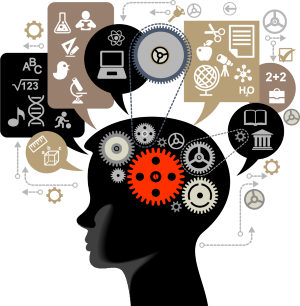

## My Learning Analytics Journey
by [**Amanda Oliveira**](https://www.linkedin.com/in/amanda-guedes-de-oliveira-0776366a/)
 
*M.S. student in Learning Analytics (Teachers College, Columbia University)*
 
*Government and Public Services Consultant (Deloitte Consulting)*
 
 

 

My name is Amanda Oliveira and I am a current student in the [MS in Learning Analytics program](https://www.tc.columbia.edu/human-development/learning-analytics/degrees--requirements/learning-analytics-ms/) at TC/Columbia University. 

The links below will take you to individual projects I developed during the Spring 2021 semester. These were submitted as class requirements for HUDK4051 - *Learning Analytics: Process & Theory* - taught by Professor [Charles Lang](https://www.tc.columbia.edu/faculty/cl3584/). 

If you are reading this, please feel free to connect with me on [LinkedIn](https://www.linkedin.com/in/amanda-guedes-de-oliveira-0776366a/). Do not hesitate to reach out if you have any questions, comments, or suggestions!

Thanks for stopping by. 

Cheers - 

**Amanda Oliveira** 
 
*June 14, 2021*

### Completed Individual Projects
* [Social Network Analysis](https://github.com/amanda-ago/1-Social-Network-Analysis)
* [Natural Language Processing](https://github.com/amanda-ago/2-Natural-Language-Processing)
* [Interactive Visualization](https://github.com/amanda-ago/3-Interactive-Visualization)
* [Prediction](https://github.com/amanda-ago/4-Prediction)
* [Neural Networks](https://github.com/amanda-ago/5-Neural-Networks)
* [Closing the Loop](https://github.com/amanda-ago/6-Closing-the-Loop)

 
 

